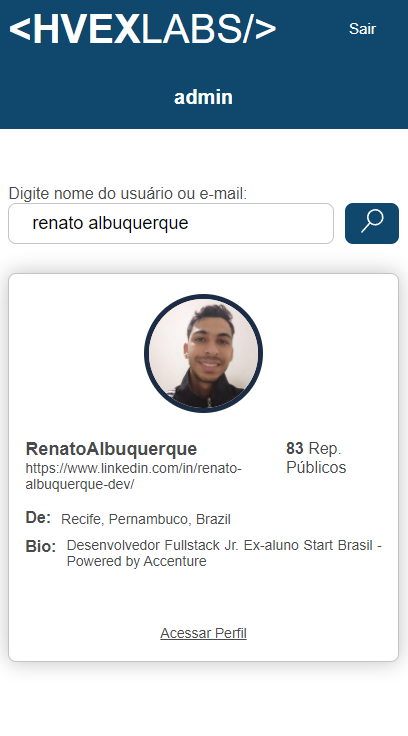
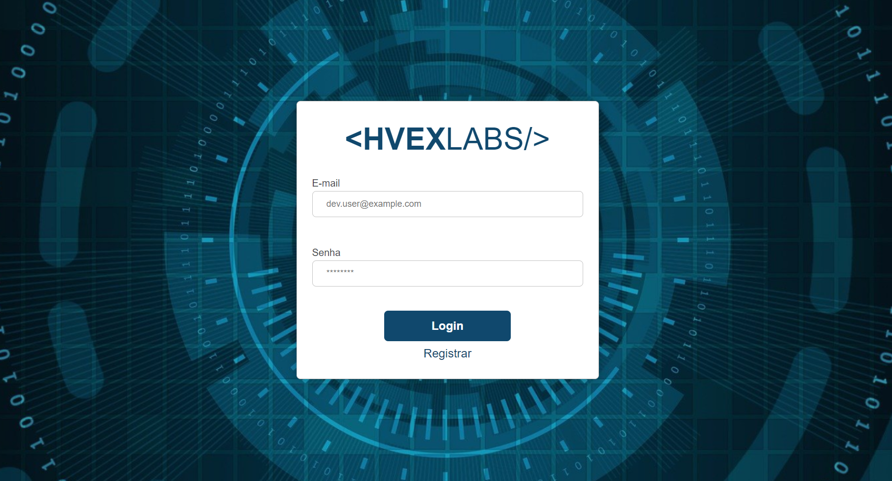
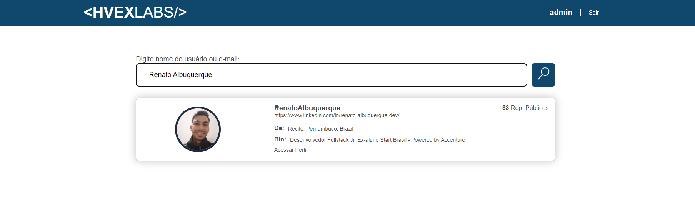

<h1 align="center">
    Hvex Login
</h1>

<p align="center">
 <a href="#-sobre-o-projeto">Sobre</a> •
 <a href="#-funcionalidades">Funcionalidades</a> •
 <a href="#-layout">Layout</a> • 
 <a href="#-como-executar-o-projeto">Como executar</a> • 
 <a href="#-tecnologias">Tecnologias</a> • 
</p>

## 💻 Sobre o projeto

Hvex login é uma página de login simples que visa simula a autenticação de usuários para acesso ao dashboard de pesquisa a perfis do github, sem a utilização de um banco de dados e com um único usuário pré configurado apenas para validação do formulário de login.

---

## ⚙️ Funcionalidades

- [x] O usuário pode simular um cadastro, de acordo com as validações que serão especificadas em tela.

- [x] O usuário pode logar na aplicação com as credenciais disponíveis no arquivo userAuth.json.
  - [x] Após o login o usuário pode pesquisar por perfis de usuários do github.

---

## 🎨 Layout

### Mobile

<p align="center">
  
</p>

### Web

<p align="center">
  
  
  
</p>

---

## 🚀 Como executar o projeto

### Pré-requisitos

Antes de começar, você vai precisar ter instalado em sua máquina um editor para trabalhar com o código como [VSCode](https://code.visualstudio.com/)

#### 🧭 Rodando a aplicação web (Frontend)

```bash
# Clone este repositório
$ git@github.com:RenatoAlbuquerque/HvexLabs.git
# Vá para a pasta da aplicação Front End
# Instale as dependências
$ npm install
# Execute a aplicação em modo de desenvolvimento
$ npm start
# A aplicação será aberta na porta:3000 - acesse http://localhost:3000
```

---

## 🛠 Tecnologias

As seguintes ferramentas foram usadas na construção do projeto:

#### **Website** ([React](https://reactjs.org/))

- **[Axios](https://github.com/axios/axios)**
- **[Formik](https://formik.org/docs/overview)**
- **[React Router Dom](https://github.com/ReactTraining/react-router/tree/master/packages/react-router-dom)**
- **[React Icons](https://react-icons.github.io/react-icons/)**
- **[Sass](https://www.npmjs.com/package/sass)**
- **[Styled-components](https://styled-components.com)**
- **[SweetAlert2](https://sweetalert2.github.io/#download)**
- **[Yup](https://github.com/jquense/yup)**

> Veja o arquivo [package.json](https://github.com/RenatoAlbuquerque/HvexLabs/blob/main/package.json)

**Utilitários**

- API: **[GITHUB API](https://developer.github.com/v3/)**
- Editor: **[Visual Studio Code](https://code.visualstudio.com/)**
- Teste de API: **[Insomnia](https://insomnia.rest/)**
